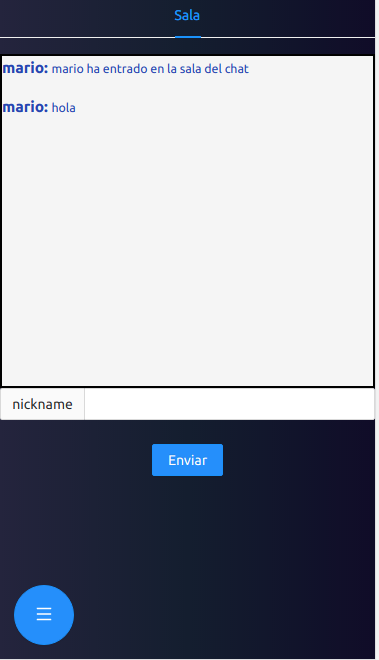

.

Socket.io es una implementacion de websockets, socket nos facilita los manejos de los websockets, ya que ofrece mecanismos para hacer salas, escuchar, emisiones, para conectar, desconectar  para manejar todo el estado de un socket.

[Demo de la aplicacion](https://proyectosmario.netlify.app/)

