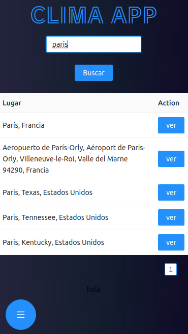
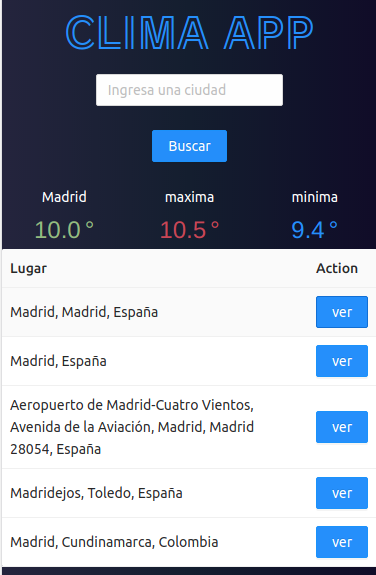

App Clima fue diseñada con fines de aprendizaje, utilizando en el backend node js y axios para peticiones a la api MapBox y OpenwWheather.

## APP CLIMA.
En esta app se utilizan las bases para realizar peticiones http a otros servidores, la aplicacion de node js en la que esta creada nuestra aplicacion en la parte del backend se comunica con otros servidores que son los que facilitan la informacion de geolocalizacion y los datos del clima. 
<!--  -->

La api de geolocalizacion que utilizamos para buscar la ubicacion ingresada se llama mapbox asi obtenemos los los lugares que coinciden con los terminos de busqueda, una vez localizada nos regresa las coordenadas del lugar seleccinado, con estas coordenadas hacemos otra peticion http a openWheatherMaps que nos devuelve la temperatura de la ubicacion seleccionada.

<!--  -->

 
[Demo de la aplicacion](https://app-clima-by-mario.vercel.app/)